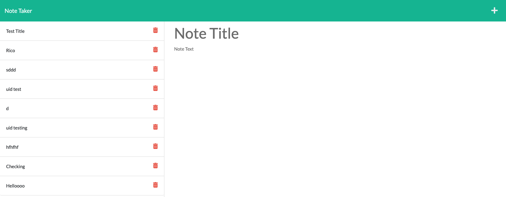
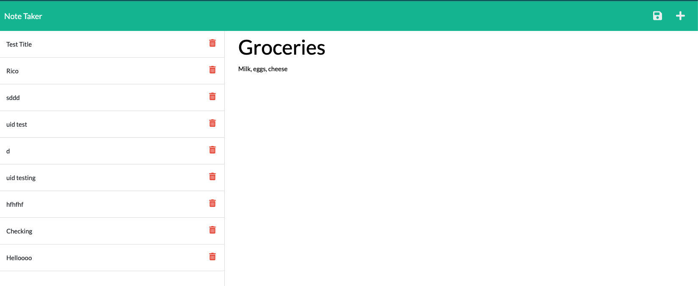

# Express.js: Note Taker

## Description

This application, called Note Taker, can be used to write and save notes. This application will use an Express.js back end and will save and retrieve note data from a JSON file.

## User Story

AS A small business owner. I WANT to be able to write and save notes, SO THAT I can organize my thoughts and keep track of tasks I need to complete.

## Steps

1. First visit the page `localhost:3002`. You will be presented with a a "Get Started" button to begin.
2. After clicking the button, you will move to `localhost:3002/notes` where you have the option to type a "Note Title" and "Note Text" of you very own.
3. After completing those new fields, simply press the floppy disk icon on the top right hand corner to save.
4. Congratulations! You will see your new note displayed on the left hand portion of the screen!

## Mock-Up

The following images show the web application's appearance and functionality:

Ricardo Garcia MIT copyright 2021
